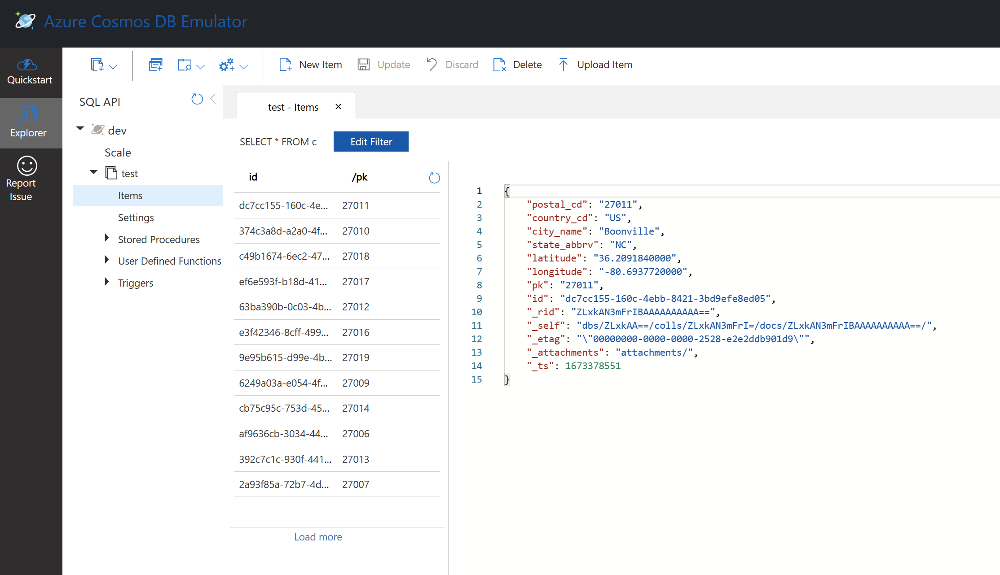

# readme for other/emulator 

## Links
- https://learn.microsoft.com/en-us/azure/cosmos-db/local-emulator

## Localhost Cosmos DB URL

- https://localhost:8081/_explorer/index.html

<p align="center">
    
</p>

## Python example

See file **apis/nosql/python/main.py** in this repo regarding 
a Python client using the local Cosmos DB emulator.

```
(venv) PS ...\python> python main.py query_emulator
```
