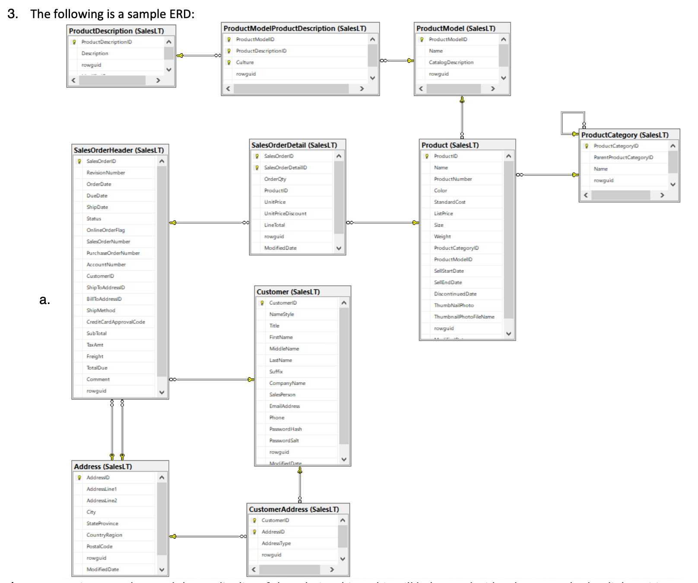

# "Cosmos DB for DBAs" - December 1, 2023

**Chris Joakim, Microsoft, Cosmos DB Global Back Belt (GBB)**


---

## Agenda

```
- Overview of Cosmos DB
- Throughput and Request Units (RU)
- Discuss Relational vs NoSQL Differences
- Briefly List Key Integrations
- Partitioning - Physical and Logical
- Design and Best Practices
- Anti-Patterns - how NOT to use Cosmos DB
- Logging and Reporting with Azure Monitor

- Identify Topics of Interest for the subsequent meetings, such as:
  - Cosmos DB Indexing
  - Deeper discussion of Logging, Reporting, Alerts
  - SQL deep-dive, Transactions, Concurrency Control
  - SDK deep-dive
  - A discussion and demonstration of the Cosmos DB Change Feed
  - A discussion and demonstration of the Cosmos DB Synapse Link and HTAP
  - Graph use-cases with Cosmos DB
  - Optimization deep-dive
```

---

## Where to get more information on Azure Cosmos DB?

- https://learn.microsoft.com/en-us/azure/cosmos-db/
- https://devblogs.microsoft.com/cosmosdb/
- See the recommended/curated hyperlinks on this page

---

## Overview of Cosmos DB

  - **Why Cosmos DB?**
    - Cosmos DB is a fully managed **PaaS** service
    - **High-Performance, and Low-Latency**
      - Capable of millions of operations per second
      - Performance SLA 10ms point-reads
    - **High Availability**
      - 99.99% (single region), 99.999% (multi-region)
      - https://learn.microsoft.com/en-us/azure/cosmos-db/high-availability
    - **Disaster Recovery** - system-managed failover, or manual failover
    - **Geo Replication**
      - Single Region deployment or Multiple Regions with fast replication
      - https://learn.microsoft.com/en-us/azure/cosmos-db/distribute-data-globally
    - **Excellent Cloud-Native Integrations**
    - **Excellent SDKs** - C#, Java, Python, JavaScript
      - https://developer.azurecosmosdb.com/community/sdk
    - **Variable Pricing Model** - RU-based, with Autoscale - pay for what you use
    - Cosmos DB Data is **Schemaless** - for agile and rapid application development
    - Automatic optional document deletion with **Time to Live (TTL)**
      - https://learn.microsoft.com/en-us/azure/cosmos-db/nosql/time-to-live

  - **It's a "Multi-Modal" database - you can create several kinds of Cosmos DB accounts**
    - We call these **APIs**
    - NoSQL
    - Mongo
    - PostgreSQL
    - Gremlin
    - Cassandra
    - Cassandra Managed Instance
    - Mongo vCore
    - We'll focus our discussion on the **NoSQL API**

  - **Deployments: Single-Region, Multi-Region, SLA, and HA/DR**
    - Single Region - 99.99% SLA
    - Single Region with Availability-Zone (AZ) - 99.995% SLA
    - Multi-Region - 99.999% SLA
      - Multi-Region with Single write region
      - Multi-Region with Multiple write regions
        - Five consistency levels - Strong to Eventual
  
  - **Distributed Nature of Cosmos DB** - see Logical and Physical Partitioning, below
  
  - **Account Structure**
    - A Cosmos DB **account** has n-number of **databases**
    - A **database** has n-number of **containers**

  - **Access Cosmos DB using read-write or read-only Keys, or RBAC (AAD/Entra)**
    - Key-based access is at the database level

  - **Document Structure**
    - Each **container** requires a **partition-key attribute** (it's NOT a primary-key)
      = The name **pk** is commonly used as the partition-key attribute
      - Each **Document** is JSON
      - Each **document is entirely schemaless** other than the partition-key
      - You can provide an **id** value, or Cosmos DB will generate it
        - id value must be unique with the partition-key
        - id is typically a uuid/guid value

  - **Sample Document**
    - see the id and pk values
    - note the system-generated underscored attributes (_ts, _etag, etc)
    - note the arbritrary nested structure of the data
      - keywords is a list
      - dependencies is an object with keys and values
      - string, integer, and number values
      - A Valid **JSON** (JavaScript Object Notation) document is a Valid Cosmos DB document

```
    {
        "id": "3a939226-f136-4970-a111-a8b63faa8f6a",
        "pk": "express",
        "doctype": "library",
        "label": "express",
        "tenant": "123",
        "lob": "npm",
        "cacheKey": "library|express",
        "name": "express",
        "desc": "Fast, unopinionated, minimalist web framework",
        "keywords": [
            "express",
            "framework",
            "sinatra",
            "web",
            "rest",
            "restful",
            "router",
            "app",
            "api"
        ],
        "dependencies": {
            "vary": "~1.1.2",
            "methods": "~1.1.2",
            "escape-html": "~1.0.3",
            "finalhandler": "~1.1.2",
            "serve-static": "1.14.1",
            "parseurl": "~1.3.3",
            "path-to-regexp": "0.1.7",
            "content-disposition": "0.5.3",
            "content-type": "~1.0.4",
            "body-parser": "1.19.0",
            "depd": "~1.1.2",
            "utils-merge": "1.0.1",
            "qs": "6.7.0",
            "debug": "2.6.9",
            "cookie": "0.4.0",
            "accepts": "~1.3.7",
            "cookie-signature": "1.0.6",
            "on-finished": "~2.3.0",
            "statuses": "~1.5.0",
            "etag": "~1.8.1",
            "proxy-addr": "~2.0.5",
            "range-parser": "~1.2.1",
            "setprototypeof": "1.1.1",
            "type-is": "~1.6.18",
            "fresh": "0.5.2",
            "encodeurl": "~1.0.2",
            "merge-descriptors": "1.0.1",
            "send": "0.17.1",
            "array-flatten": "1.1.1",
            "safe-buffer": "5.1.2"
        },
        "devDependencies": {
            "marked": "0.6.2",
            "istanbul": "0.4.5",
            "pbkdf2-password": "1.2.1",
            "express-session": "1.16.1",
            "mocha": "5.2.0",
            "ejs": "2.6.1",
            "multiparty": "4.2.1",
            "cookie-parser": "~1.4.4",
            "eslint": "2.13.1",
            "vhost": "~3.0.2",
            "connect-redis": "3.4.1",
            "morgan": "1.9.1",
            "method-override": "3.0.0",
            "hbs": "4.0.4",
            "should": "13.2.3",
            "supertest": "3.3.0",
            "after": "0.8.2",
            "cookie-session": "1.3.3"
        },
        "author": "TJ Holowaychuk <tj@vision-media.ca>",
        "maintainers": [
            "dougwilson <doug@somethingdoug.com>",
            "jasnell <jasnell@gmail.com>",
            "mikeal <mikeal.rogers@gmail.com>"
        ],
        "version": "4.17.1",
        "homepage": "http://expressjs.com/",
        "library_age_days": 3166,
        "version_age_days": 96,
        "_etag": "\"0500a282-0000-0100-0000-63e1807a0000\"",
        "_rid": "gm8hALNuoCu8AwAAAAAAAA==",
        "_self": "dbs/gm8hAA==/colls/gm8hALNuoCs=/docs/gm8hALNuoCu8AwAAAAAAAA==/",
        "_attachments": "attachments/",
        "_ts": 1675722874
    }
```

---

## Throughput and Request Units (RU)

  - **Request Units**
    - The **Request Unit (RU) is the unit of throughput and scale**
    - https://learn.microsoft.com/en-us/azure/cosmos-db/request-units
    - Read a 1KB document by its' id and partition key = 1.0 RU
    - Write a 1KB document is approx 5 RUs

  - **Provisioned Throughput**
    - **You configure Cosmos DB Throughput** - at the Database Level or Container Level
      - Container Level - this is the typical case
      - Database Level - For 25 or fewer Containers
    - Think of the RU Throughput Level as a **per-second-capacity or "budget"**
    - You can use **Manual Throughput** (per container) or **Autoscale Throughput**
    - Throughput is available 24x7
    - There is a minimum Throughput value, typically 400
    - With **Autoscale** you specify the max throughput and Cosmos DB can scale down to 10% of max
    - https://learn.microsoft.com/en-us/azure/cosmos-db/set-throughput
    - https://learn.microsoft.com/en-us/azure/cosmos-db/provision-throughput-autoscale

  - **What happens when your usage exceeds your provisioned throughput level?**
    - Cosmos DB will throw an **error code 429** back to the application
    - Handle this explicitly in your code with try/catch blocks
    - These can be handled and retried implicitly - SDKs and Spark
      - You can configure the retry count in the SDK
    - https://learn.microsoft.com/en-us/azure/cosmos-db/nosql/troubleshoot-request-rate-too-large?tabs=resource-specific

  - You can also create a **"Serverless" Cosmos DB Account**
    - Has capacity and throughput limits
    - Pay per actual RU use
    - Can "scale-to-zero"
    - Best for Dev and Test environments
    - https://learn.microsoft.com/en-us/azure/cosmos-db/serverless

---

## Discuss Relational vs NoSQL Differences

- Nodes - Single vs Horizontal
- Schemas - fixed vs flexible, re: both structure and datatypes
- Transactions - Across tables vs In-Container In-Logical-Partition
- Joins - Locking vs OCC
- Data Duplication - 3NF vs Intentional Duplication in some cases
- ANSI SQL vs Cosmos DB SQL

---

## Briefly List Key Integrations

  - Ingestion
    - Azure Data Factory (ADF)
    - Azure Stream Analytics
    - Spark - Azure Synapse, Azure Databricks, Microsoft Fabric
    - SDK Clients - DotNet, Java, Python, JavaScript, etc
  - Outputs
    - Azure AI Search (formerly Cognitive Search)
    - Change Feed
    - Synapse Link and the HTAP pattern

We can cover these in future sessions.

---

## Logical and Physical Partitioning

- These concepts apply to individual containers/collections, not databases
- You simply define the **partition key** attribute
  - Each document needs to have this attribute populated
  - **pk** is a good name, or use an attribute you already use (i.e. - customerId)
- **Cosmos DB Manages the Physical Partitions**
- **Physical Partitions**
  - Stores up to **50GB** of data
  - Supports up to **10,000 Request Units** (RUs) of throughput
  - Cosmos DB creates these as your data grows, or you increase the RU setting
- **Terminology - Logical Partitions**
  - The set of documents with a given partition key value
  - **Max 20GB**
  - A Logical Partition lives within one Physical Partition
  - Cosmos DB may "shuffle", or relocate, the logical partitions as necessary; with no perf impact

<p align="center">
    
</p>

---

## Design and Best Practices

- Start with one container, add more as necessary
  - Don't start with a complex ERD diagram and try to port the design to Cosmos DB

- Choice of a Partition Key is Critical
  - It should be a value that you often/usually query on
  - Avoid **cross-partition** queries
  - The value should be **well-distributed with high-cardinality**

- Prefer smaller documents

- Disimilar but related documents can/should be put in the same container
  - Sales example - a sale document, the line items, the deliveries

- Nested arrays are Ok, but not if unbounded

- Optimize with Indexing

- Utilize other Azure PaaS services for the "total application solution", not just Cosmos DB
  - Event-Driven apps can use the Cosmos DB Change Feed and Azure Functions
  - Synapse Link and Azure Synapse for batch and analytic processing
  - Azure AI Search (formerly Cognitive Search) for apps with many cross-partition and fuzzy queries

- Links
  - https://learn.microsoft.com/en-us/azure/cosmos-db/nosql/modeling-data

---

## Anti-Patterns - how NOT to use Cosmos DB

- Cosmos DB is not a **data lake**
- Cosmos DB is not a **data warehouse**
- Avoid repeated daily truncate-and-bulk-load scenarios
- Low-cardinality and Highly-skewed partition keys, such as Country Code
- Think differently - Please don't try to use a Relational Entity-based design



---

## Intro to Logging and Reporting with Azure Monitor

- [Logging Presentation in this repo](https://github.com/cjoakim/azure-cosmos-db/tree/main/presentations/logging)

- [Throughput Control repo](https://github.com/cjoakim/azure-cosmos-db-throughput/tree/main/java)