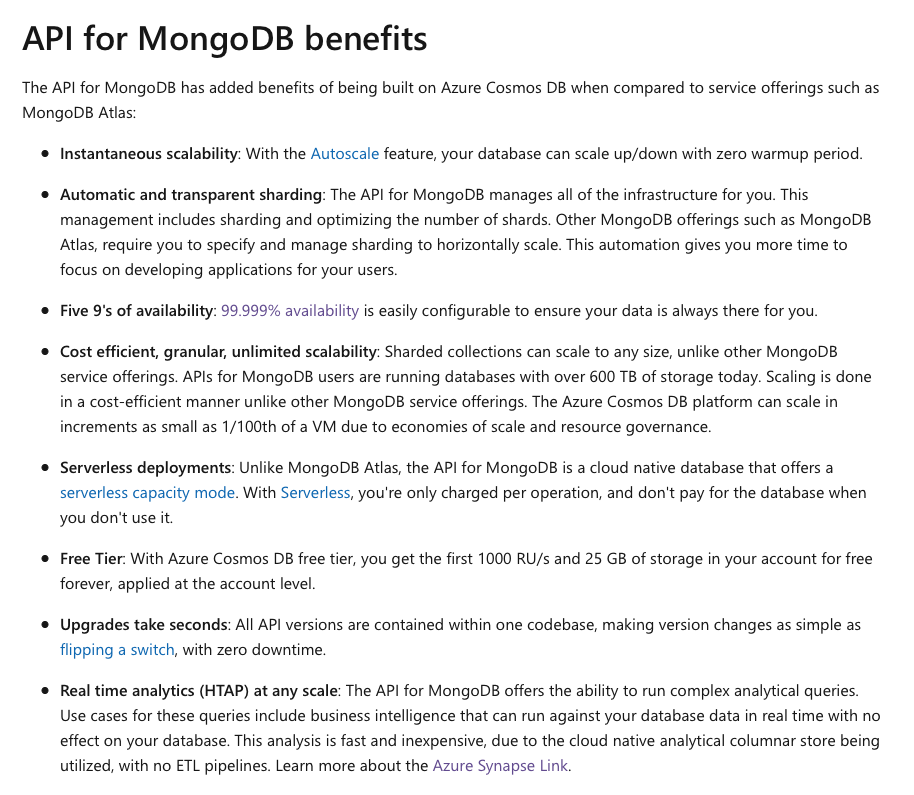

# Azure Cosmos DB : Architecture and Operations

**Chris Joakim, Microsoft, Cosmos DB Global Back Belt (GBB)**

This presentation: https://github.com/cjoakim/azure-cosmos-db-presentations/tree/main/mongo_indexing

## Architecture

    

## Operations and Best Practices

