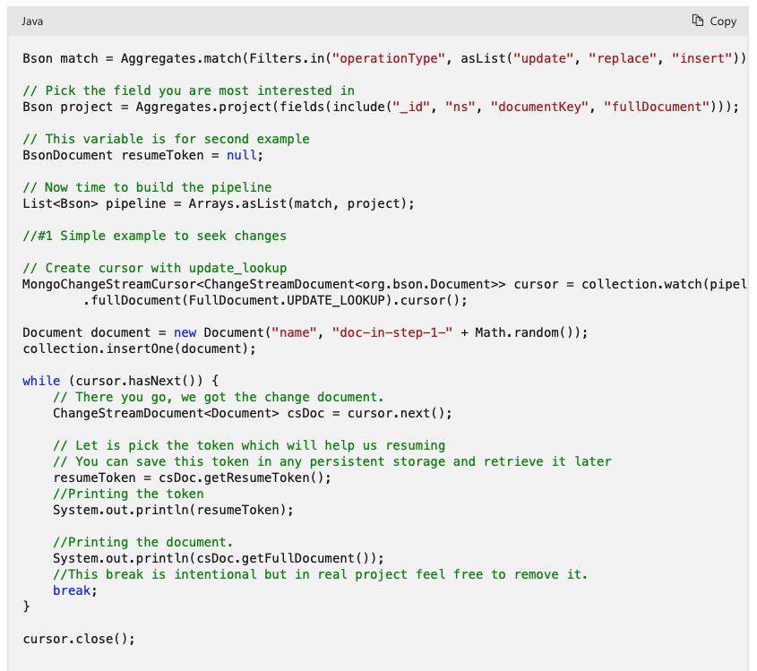
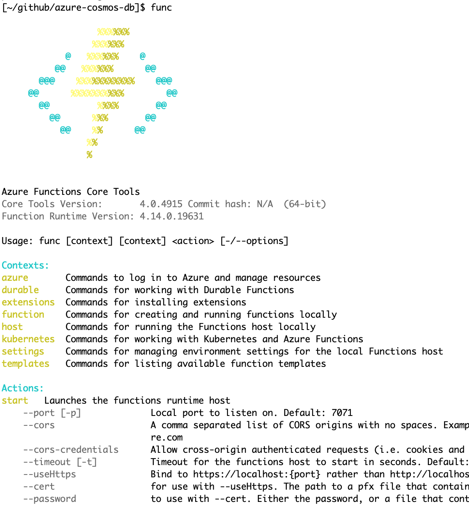

# Azure Cosmos DB : Change Feed

Chris Joakim, Microsoft, Cosmos DB GBB

This presentation: https://github.com/cjoakim/azure-cosmos-db-presentations/tree/main/change_feed

---

## Cosmos DB Change Feed

<p align="center">
    
</p>

**The change feed in Azure Cosmos DB is a persistent record of changes to a container in the order they occur**

**The persisted changes can be processed asynchronously and incrementally, and the output can be distributed across one or more consumers for parallel processing**

**The Change Feed is typically consumed with an Azure Function (see below)**

**Change feed is enabled by default for all Azure Cosmos DB accounts**

**The change feed includes inserts and update operations made to items within the container (not deletes)**

**You can capture deletes by setting a "soft-delete" flag within your documents**

**With the Mongo API, it simulates MongoDB change-stream functionality**

- Links
  - https://learn.microsoft.com/en-us/azure/cosmos-db/change-feed

### Mongo API 

**Change feed support in Azure Cosmos DB’s API for MongoDB is available by using the Change Streams API.** 

**By using the change streams API, your applications can get the changes made to the collection or to the items in a single shard. Changes to the items in the collection are captured in the order of their modification time and the sort order is guaranteed per shard key.**

**With the Mongo API use application code, rather than an Azure Function, to consume the stream.**

**There is not currently support for Azure Functions triggers to process change streams.**

- Links
  - https://learn.microsoft.com/en-us/azure/cosmos-db/mongodb/change-streams?tabs=java
  - https://learn.microsoft.com/en-us/azure/cosmos-db/mongodb/change-streams?tabs=javascript
  - https://learn.microsoft.com/en-us/azure/cosmos-db/mongodb/change-streams?tabs=csharp

#### JavaScript example

```
var cursor = db.coll.watch(
    [
        { $match: { "operationType": { $in: ["insert", "update", "replace"] } } },
        { $project: { "_id": 1, "fullDocument": 1, "ns": 1, "documentKey": 1 } }
    ],
    { fullDocument: "updateLookup" });

while (!cursor.isExhausted()) {
    if (cursor.hasNext()) {
        printjson(cursor.next());
    }
}
```

#### Java example


<p align="center">
    
</p>

- Links
  - https://learn.microsoft.com/en-us/azure/cosmos-db/mongodb/change-streams?tabs=java
  - https://github.com/Azure-Samples/azure-cosmos-db-mongodb-java-changestream/blob/main/mongostream/src/main/java/com/azure/cosmos/mongostream/App.java

---

## Intro to Azure Functions

<p align="center">
    
</p>

**Azure Functions are Serverless Event-Driven Apps**

- https://azure.microsoft.com/en-us/products/functions/
- https://learn.microsoft.com/en-us/azure/azure-functions/functions-overview
- https://learn.microsoft.com/en-us/azure/azure-functions/
- https://learn.microsoft.com/en-us/azure/azure-functions/functions-triggers-bindings (Event Types)

### Programming Languages

- **C#, JavaScript (Node.js), Java, Python, TypeScript, PowerShell, F#**
- https://learn.microsoft.com/en-us/azure/azure-functions/supported-languages

### Programming Environments

- Many IDEs - Visual Studio, Visual Studio, IntelliJ, Eclipse, etc
- https://learn.microsoft.com/en-us/azure/azure-functions/functions-create-maven-intellij
- https://learn.microsoft.com/en-us/azure/azure-functions/functions-create-maven-eclipse
- https://blog.jetbrains.com/dotnet/2020/10/29/build-serverless-apps-with-azure-functions/

### Local Development 

- **Azure Functions Core Tools** - Command-line tools for local development and testing

<p align="center">
    
</p>

```
$ func init
Select a number for worker runtime:
1. dotnet
2. dotnet (isolated process)
3. node
4. python
5. powershell
6. custom

...
```

---

### Cosmos DB Change-Feed Functions in this Repo

- other/functions/changefeed/dotnet directory
- other/functions/changefeed/node directory


---

## Consume the Cosmos DB Change-Feed with SDK code (NoSQL API only)

- Must customers use Azure Functions
- But you can optionally use Java and DotNet SDKs
- https://learn.microsoft.com/en-us/azure/cosmos-db/nosql/change-feed-processor

---

<p align="center">
    
</p>

<p align="center">
    
</p>
