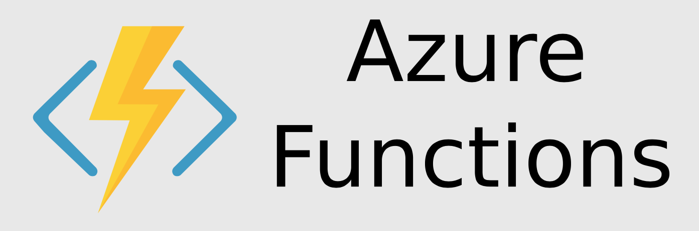

# Azure Cosmos DB : Change Feed

**Chris Joakim, Microsoft, Cosmos DB Global Back Belt (GBB)**

This presentation: https://github.com/cjoakim/azure-cosmos-db-presentations/tree/main/change_feed

---

## Cosmos DB Change Feed

<p align="center">
    
</p>

**The change feed in Azure Cosmos DB is a persistent record of changes to a container in the order they occur**

**The persisted changes can be processed asynchronously and incrementally, and the output can be distributed across one or more consumers for parallel processing**

**The Change Feed is typically consumed with an Azure Function (see below)**

**Change feed is enabled by default for all Azure Cosmos DB accounts**

**The change feed includes inserts and update operations made to items within the container (not deletes)**

**You can capture deletes by setting a "soft-delete" flag within your documents**

**With the Mongo API, it simulates MongoDB change-stream functionality**

- Links
  - https://learn.microsoft.com/en-us/azure/cosmos-db/change-feed

### Mongo API 

**Change feed support in Azure Cosmos DB’s API for MongoDB is available by using the Change Streams API.** 

**With the Mongo API use application code, rather than an Azure Function, to consume the stream.**

**There is currently no support for Azure Functions triggers to process change streams.**

- Links
  - https://learn.microsoft.com/en-us/azure/cosmos-db/mongodb/change-streams?tabs=java
  - https://learn.microsoft.com/en-us/azure/cosmos-db/mongodb/change-streams?tabs=javascript
  - https://learn.microsoft.com/en-us/azure/cosmos-db/mongodb/change-streams?tabs=csharp

#### JavaScript example

```
var cursor = db.coll.watch(
    [
        { $match: { "operationType": { $in: ["insert", "update", "replace"] } } },
        { $project: { "_id": 1, "fullDocument": 1, "ns": 1, "documentKey": 1 } }
    ],
    { fullDocument: "updateLookup" });

while (!cursor.isExhausted()) {
    if (cursor.hasNext()) {
        printjson(cursor.next());
    }
}
```

#### Java example


<p align="center">
    
</p>

- Links
  - https://learn.microsoft.com/en-us/azure/cosmos-db/mongodb/change-streams?tabs=java
  - https://github.com/Azure-Samples/azure-cosmos-db-mongodb-java-changestream/blob/main/mongostream/src/main/java/com/azure/cosmos/mongostream/App.java

--- 

## Demonstration Application - Vehicle Transponder Events

<p align="center">
    
</p>

### Python App to Emit Similated Vehicle Transponder Telemetry

See the **apis/mongo/python/** directory in this repo.  

#### Start the program

```
.\venv\Scripts\Activate.ps1    <-- activate the Python virtual environment (venv)

python main.py create_customer_activity_stream <sleep_secs> <doc_count>    <-- command-line format

python main.py create_customer_activity_stream 1.5 100    <-- execute the program

create_customer_activity_stream; sleep_secs: 3.0, doc_count: 4
connecting to cosmosdb ...
{
  "conn_string": "mongodb://gbbcjmongo:esv5gA83NCZRx2mkkJabWpssh1rOGNTSIB3k550yqUu8Fl8YidFTG2nyDY8KRzJIN5KYk1tEj5jZACDbKyyqaA==@gbbcjmongo.mongo.cosmos.azure.com:10255/?ssl=true&replicaSet=globaldb&retrywrites=false&maxIdleTimeMS=120000&appName=@gbbcjmongo@",
  "verbose": true
}
Database(MongoClient(host=['gbbcjmongo.mongo.cosmos.azure.com:10255'], document_class=dict, tz_aware=False, connect=True, ssl=True, replicaset='globaldb', retrywrites=False, maxidletimems=120000, appname='@gbbcjmongo@'), 'dev')
1678641808

...

---
{
  "pk": "GB10JZTF50009988214118",
  "utc_time": "2023-03-12 17:23:41.196935",
  "transponder": "GB10JZTF50009988214118",
  "location": [
    "28.54944",
    "-81.77285",
    "Clermont",
    "US",
    "America/New_York"
  ],
  "vehicle": {
    "Year": 1997,
    "Make": "Mercedes-Benz",
    "Model": "E-Class",
    "Category": "Sedan"
  },
  "plate": "234LB"
}
insert_doc; id: 640e0a9db64d3c25a151f8b3 -> {'pk': 'GB10JZTF50009988214118', 'utc_time': '2023-03-12 17:23:41.196935', 'transponder': 'GB10JZTF50009988214118', 'location': ('28.54944', '-81.77285', 'Clermont', 'US', 'America/New_York'), 'vehicle': {'Year': 1997, 'Make': 'Mercedes-Benz', 'Model': 'E-Class', 'Category': 'Sedan'}, 'plate': '234LB', '_id': ObjectId('640e0a9db64d3c25a151f8b3')}
```

### Python App to Consume the Change-Stream

See the **apis/mongo/python/** directory in this repo (same directory as above emitter)

See https://www.mongodb.com/developer/languages/python/python-change-streams/

```
python change_stream_consumer.py consume dev vehicle_activity

consuming change stream for db: dev, container: vehicle_activity
-
MongoClient(host=['gbbcjmongo.mongo.cosmos.azure.com:10255'], document_class=dict, tz_aware=False, connect=True, ssl=True, replicaset='globaldb', retrywrites=False, maxidletimems=120000, appname='@gbbcjmongo@')
-
Database(MongoClient(host=['gbbcjmongo.mongo.cosmos.azure.com:10255'], document_class=dict, tz_aware=False, connect=True, ssl=True, replicaset='globaldb', retrywrites=False, maxidletimems=120000, appname='@gbbcjmongo@'), 'dev')
-
Collection(Database(MongoClient(host=['gbbcjmongo.mongo.cosmos.azure.com:10255'], document_class=dict, tz_aware=False, connect=True, ssl=True, replicaset='globaldb', retrywrites=False, maxidletimems=120000, appname='@gbbcjmongo@'), 'dev'), 'vehicle_activity')
starting to watch the change stream ...

...

---
change event:
{'_id': {'_data': b'{"V":2,"Rid":"yPVsAJ5rJtA=","Continuation":[{"FeedRange":{"type":"Effective Partition Key Range","value":{"min":"","max":"FF"}},"State":{"type":"continuation","value":"\\"735\\""}}]}', '_kind': 1}, 'fullDocument': {'_id': ObjectId('640e0a9db64d3c25a151f8b3'), 'pk': 'GB10JZTF50009988214118', 'utc_time': '2023-03-12 17:23:41.196935', 'transponder': 'GB10JZTF50009988214118', 'location': ['28.54944', '-81.77285', 'Clermont', 'US', 'America/New_York'], 'vehicle': {'Year': 1997, 'Make': 'Mercedes-Benz', 'Model': 'E-Class', 'Category': 'Sedan'}, 'plate': '234LB'}, 'ns': {'db': 'dev', 'coll': 'vehicle_activity'}, 'documentKey': {'pk': 'GB10JZTF50009988214118', '_id': ObjectId('640e0a9db64d3c25a151f8b3')}}
ns:
{'db': 'dev', 'coll': 'vehicle_activity'}
documentKey:
{'pk': 'GB10JZTF50009988214118', '_id': ObjectId('640e0a9db64d3c25a151f8b3')}
fullDocument:
{'_id': ObjectId('640e0a9db64d3c25a151f8b3'), 'pk': 'GB10JZTF50009988214118', 'utc_time': '2023-03-12 17:23:41.196935', 'transponder': 'GB10JZTF50009988214118', 'location': ['28.54944', '-81.77285', 'Clermont', 'US', 'America/New_York'], 'vehicle': {'Year': 1997, 'Make': 'Mercedes-Benz', 'Model': 'E-Class', 'Category': 'Sedan'}, 'plate': '234LB'}
```

---

## Intro to Azure Functions

<p align="center">
    
</p>

**Azure Functions are Serverless Event-Driven Apps**

- https://azure.microsoft.com/en-us/products/functions/
- https://learn.microsoft.com/en-us/azure/azure-functions/functions-overview
- https://learn.microsoft.com/en-us/azure/azure-functions/
- https://learn.microsoft.com/en-us/azure/azure-functions/functions-triggers-bindings (Event Types)

### Programming Languages

- **C#, JavaScript (Node.js), Java, Python, TypeScript, PowerShell, F#**
- https://learn.microsoft.com/en-us/azure/azure-functions/supported-languages

### Programming Environments

- Many IDEs - Visual Studio, Visual Studio, IntelliJ, Eclipse, etc
- https://learn.microsoft.com/en-us/azure/azure-functions/functions-create-maven-intellij
- https://learn.microsoft.com/en-us/azure/azure-functions/functions-create-maven-eclipse
- https://blog.jetbrains.com/dotnet/2020/10/29/build-serverless-apps-with-azure-functions/

### Local Development 

- **Azure Functions Core Tools** - Command-line tools for local development and testing

<p align="center">
    
</p>

-

#### Creating a new Azure Function with Core Tools

<p align="center">
    
</p>

---

### Cosmos DB Change-Feed Azure Functions in this Repo

- other/functions/changefeed/dotnet directory
- other/functions/changefeed/node directory

---

## Consume the Cosmos DB Change-Feed with SDK code (NoSQL API only)

- Must customers use Azure Functions
- But you can optionally use Java and DotNet SDKs
- https://learn.microsoft.com/en-us/azure/cosmos-db/nosql/change-feed-processor

---

## Further Reading

Please see the **Azure Cosmos DB for MongoDB documentation** at https://learn.microsoft.com/en-us/azure/cosmos-db/mongodb/

---
---

<p align="center">
    
</p>

<p align="center">
    
</p>
