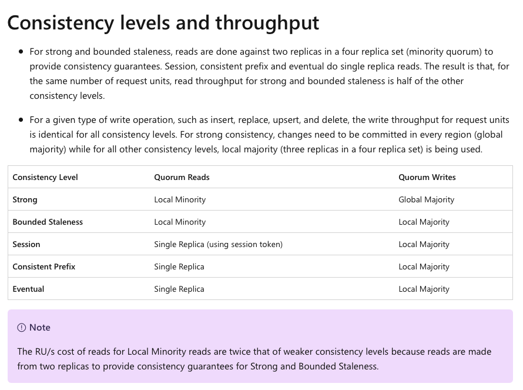

# Azure Cosmos DB : Global Distribution and Consistency Levels

Chris Joakim, Microsoft, Cosmos DB GBB

This presentation: https://github.com/cjoakim/azure-cosmos-db-presentations/tree/main/global_distribution

---

## Global Distribution

### Azure Cosmos DB is a globally distributed database system that allows you to read and write data from the local replicas of your database. 

### Azure Cosmos DB transparently replicates the data to all the regions associated with your Azure Cosmos DB account.

### Azure Cosmos DB is a globally distributed database service that's designed to provide low latency, elastic scalability of throughput, well-defined semantics for data consistency, and high availability.

### In short, if your application needs fast response time anywhere in the world, if it's required to be always online, and needs unlimited and elastic scalability of throughput and storage, you should build your application on Azure Cosmos DB.

---

### Azure Physical Infrastructure

- 200+ Data Centers
- 60+ Azure regions (see map below)
- 165,000 miles of fiber optic and undersea cable systems
- See https://azure.microsoft.com/en-us/explore/global-infrastructure/

    

    

---

### Cosmos DB Deployment Options

- **Single Region, with no Availability Zone**
- **Single Region, with Availability Zone** (available in some regions)
- **Multiple Regions - with one Write Region**, 1+ Read Regions
- **Multiple Regions - with multiple Write Regions**

- Links
  - https://learn.microsoft.com/en-us/azure/cosmos-db/
  - https://learn.microsoft.com/en-us/azure/cosmos-db/distribute-data-globally
  - https://azure.microsoft.com/en-us/explore/global-infrastructure/geographies/#overview

---

#### Cosmos DB Guranteed Service Level Agreement (SLA)

- Single region --> **99.99%**
- Single region with AZ --> **99.995%**
- Multiple region --> **99.999%**

- Links
  - https://learn.microsoft.com/en-us/azure/cosmos-db/high-availability
  - https://azurecharts.com/sla

---

### Azure Regions

  

- Links
  - https://infrastructuremap.microsoft.com/explore
  - https://azure.microsoft.com/en-us/explore/global-infrastructure/geographies/#geographies

**Brazil South** region, with Availability Zones, since 2014, São Paulo State

---

### Availability Zones

    

- Links
  - https://learn.microsoft.com/en-us/azure/reliability/availability-zones-overview
  - https://learn.microsoft.com/en-us/azure/reliability/availability-zones-service-support#azure-regions-with-availability-zone-support

---

### Configure Cosmos DB Regions in Azure Portal

    

**You can also provision/configure Cosmos DB with DevOps tools - ARM, Bicep, PowerShell, az CLI, Terraform, etc.**

- Links
  - https://learn.microsoft.com/en-us/azure/cosmos-db/nosql/manage-with-templates  (ARM = Azure Resource Manager)
  - https://learn.microsoft.com/en-us/azure/cosmos-db/nosql/manage-with-bicep
  - https://learn.microsoft.com/en-us/azure/cosmos-db/nosql/manage-with-powershell
  - https://learn.microsoft.com/en-us/azure/cosmos-db/nosql/manage-with-cli
  - https://learn.microsoft.com/en-us/azure/cosmos-db/nosql/manage-with-terraform
  - https://registry.terraform.io/providers/hashicorp/azurerm/latest/docs/resources/cosmosdb_account

---

### Cosmos DB High Availability 

- Manual Failover, or
- **Service Managed Failover (recommended)**
- See above Azure Portal screenshot
- You define region failover sequence: Region1 -> Region2
- https://learn.microsoft.com/en-us/azure/cosmos-db/high-availability

    

---

### Example Architecture

    

---

### Cosmos DB Consistency Levels

**This concept only applies to multi-region Cosmos DB accounts**.

Azure Cosmos DB offers **five well-defined consistency levels**. From strongest to weakest, the levels are:

- **Strong**
  - Writes are applied to all regions before returning a response to the client
  - Reads are guaranteed to return the most recent committed version of an item
- **Bounded Staleness**
  - You define the aceptable lag, or staleness
    - Using either:
      - The number of versions (K) of the item
      - The time interval (T) reads might lag behind the writes
  - Bounded Staleness works best for apps using a single-region write accounts with two or more regions
- **Session (the default)**
  - Within a single client session, reads are guaranteed to honor the read-your-writes
- **Consistent Prefix**
  - In all the regions, the reads never see out of order writes for a transactional batch of writes
- **Eventual**
  - Eventual consistency is ideal where the application doesn't require any ordering guarantees
  - Examples include count of Retweets, Likes, or non-threaded comments

    

- You set the default consistency level at the Cosmos DB Account Level
- You can also override the default consistency level for a specific request

    

- Links
  - https://learn.microsoft.com/en-us/azure/cosmos-db/consistency-levels
  - https://en.wikipedia.org/wiki/PACELC_theorem
  - [Mark Brown - Cosmos Global Distribution Demos](https://github.com/markjbrown/cosmos-global-distribution-demos)

#### Cosmos DB Cost Implications of Multi-Region and Consistency Levels

    

**In short, 2x RU for Strong and Bounded Staleness**

- Links
  - https://learn.microsoft.com/en-us/azure/cosmos-db/consistency-levels#consistency-levels-and-throughput
  - https://learn.microsoft.com/en-us/azure/cosmos-db/optimize-cost-regions
  - https://learn.microsoft.com/en-us/azure/cosmos-db/understand-your-bill

---

#### Cosmos DB Conflict Resolution

**This concept only applies to multi-region multi-writable Cosmos DB accounts**.

> With multi-region writes, when multiple clients write to the same item, conflicts may occur.
>
> When a conflict occurs, you can resolve the conflict by using different conflict resolution policies.
>
> **The default path for last-writer-wins is the timestamp field or the _ts property.**

    

**Custom Resolution Policy in Azure Portal (NoSQL API)**

    

    

**Custom Resolution Policy Example (NoSQL API)**

    

- https://learn.microsoft.com/en-us/azure/cosmos-db/nosql/how-to-manage-conflicts

---

### Multi-Homing and Connecting to a preferred region

This topic is discussed in another training session

---

## Further Reading

Please see the **Azure Cosmos DB for MongoDB documentation** at https://learn.microsoft.com/en-us/azure/cosmos-db/mongodb/

---

    

    

