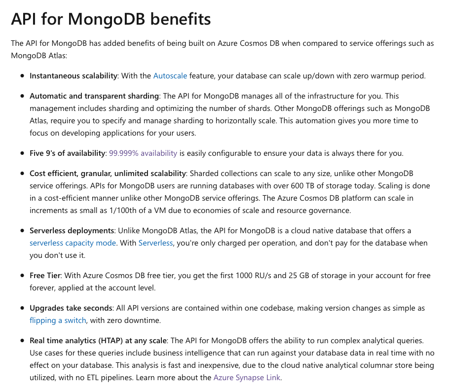
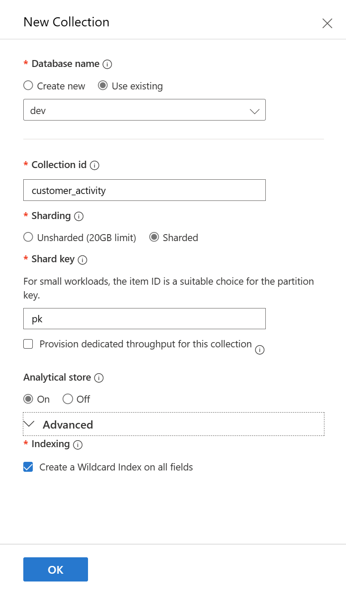
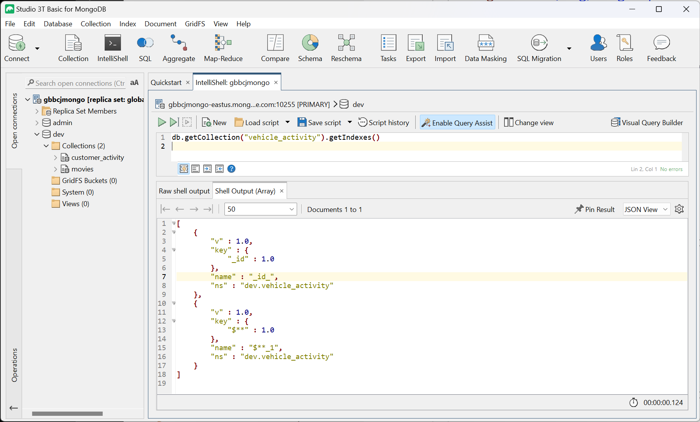
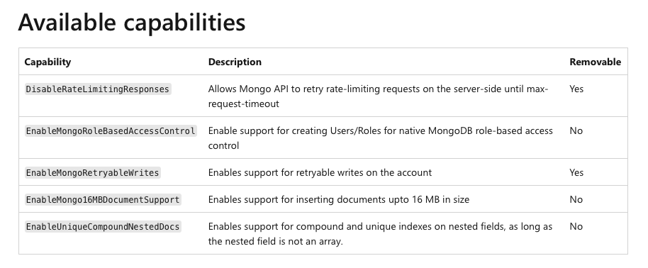
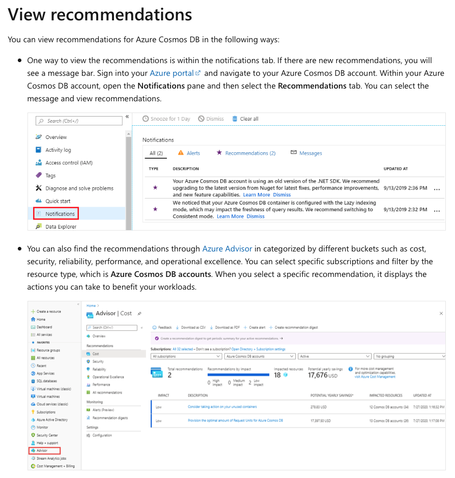

# Azure Cosmos DB : Mongo API Indexing

**Chris Joakim, Microsoft, Cosmos DB Global Back Belt (GBB)**

This presentation: https://github.com/cjoakim/azure-cosmos-db-presentations/tree/main/mongo_indexing

## The Cosmos DB Mongo API

<p align="center">
    
</p>

- Links
  - https://learn.microsoft.com/en-us/azure/cosmos-db/mongodb/introduction

---

## Indexing 

- The indexing **syntax is the same** as MongoDB
- The **tooling is the same** as MongoDB - mongosh, Studio 3T, etc
- Index updates are always done in the background with unused Request Units (RUs)
- Index updates/progress can be tracked (see link below)
- **Just like MongoDB, Cosmos DB requires efficient indexes for your applications to perform well**
- The Cosmos DB NoSQL API offers indexing on all fields by default, but **not** the Mongo API
- However, you can create a wildcard index when you create a container like this (see checkbox):

<p align="center">
    
</p>

```
db.getCollection("vehicle_activity").getIndexes()

[
    {
        "v" : 1.0,
        "key" : {
            "_id" : 1.0
        },
        "name" : "_id_",
        "ns" : "dev.vehicle_activity"
    },
    {
        "v" : 1.0,
        "key" : {
            "$**" : 1.0
        },
        "name" : "$**_1",
        "ns" : "dev.vehicle_activity"
    }
]
```

<p align="center">
    
</p>

---

## Indexing Types

### Single Attribute

```
db.coll.createIndex( {name : 1} )
```

### Compound / Multiple Attributes

```
db.coll.createIndex( {name : 1, age : 1} )
```

### Multikey / Array

Azure Cosmos DB creates multikey indexes to index content stored in arrays.

If you index a field with an array value, Azure **Cosmos DB automatically indexes every element in the array.**

### Geospatial

Azure Cosmos DB for MongoDB supports **2dsphere geospatial** indexes.

```
db.coll.createIndex( { location : "2dsphere" } )
```

- Links:
  - https://www.mongodb.com/docs/manual/core/2dsphere/
  - https://www.mongodb.com/docs/manual/geospatial-queries/#std-label-geospatial-geojson
  - https://www.mongodb.com/docs/manual/reference/geojson/

### Wildcard

```
db.coll.createIndex( {"children.$**" : 1} )
```

### Unique

**Unique indexes need to be created while the collection is empty.**

#### Unsharded containers/collections

```
db.coll.createIndex( { "student_id" : 1 }, {unique : true } )  <-- no partition key
```

#### Sharded containers/collections

For sharded collections, **you must provide the shard (partition) key to create a unique index.**

```
db.coll.createIndex( { "university" : 1, "student_id" : 1 }, { unique : true } );   <-- university is partition key
```

### TTL

A TTL index is an index on the **_ts** field

```
db.coll.createIndex( {"_ts" : 1}, { expireAfterSeconds : 10} )
```

See https://learn.microsoft.com/en-us/azure/cosmos-db/mongodb/time-to-live

### Indexing all properties

```
db.coll.createIndex( { "$**" : 1 } )
```

- Links
  - https://learn.microsoft.com/en-us/azure/cosmos-db/mongodb/indexing

---

## Indexing Limitations

### Not Supported

- Wildcard indexes on Compound, TTL, or Unique indexes
- See the list below that is apt to be reported by the MMA tool

---

## MongoMigrationAssessment.exe (MMA) Sample Index Advice

#### Warning: Unique Index

Unique indexes can only be created on empty collections currently in Azure Cosmos DB API for MongoDB v4.2. Please make sure you migrate the data to Cosmos DB after creating the index. Functionality to create unique indexes on non-empty collections will be available soon.

#### Warning: Partial Index

Partial index with TTL is not supported with Cosmos DB for MongoDB v4.2.

#### Critical: Text Index

Text indexes are currently not supported in Azure Cosmos DB for MongoDB.
We recommend using Azure Cognitive Search for full text search and advanced search features like wildcard search etc.

#### Critical: Compound Index on Nested field

Compound indexes with nested fields are not fully supported in Azure Cosmos DB for MongoDB v4.2.
If you are using compound index where the nested fields are docs (not arrays), you may enable the 
**EnableUniqueCompoundNestedDocs** capability on your Cosmos DB account.  
See https://learn.microsoft.com/en-us/azure/cosmos-db/mongodb/how-to-configure-capabilities#available-capabilities

#### Critical: Sparse Index

Sparse indexes are not supported with Cosmos DB for MongoDB v4.2. Consider using partial indexes instead.

#### Critical: Unique Index on Nested field

Unique indexes with nested fields are not fully supported in Azure Cosmos DB API for MongoDB v4.2.
If you are using unique index where the nested fields are docs (not arrays), you may enable the 
**EnableUniqueCompoundNestedDocs** capability on your Cosmos DB account.
See https://learn.microsoft.com/en-us/azure/cosmos-db/mongodb/how-to-configure-capabilities#available-capabilities

#### Critical: TTL Index

Cosmos DB for MongoDB v4.2 does not support creating TTL indexes on multiple fields.
You may only create TTL index on one field per collection.

#### Critical: Compound Index fields size

Cosmos DB API for MongoDB v4.2 supports a maximum of 8 fields in a compound index.
You would need to reduce the number of fields in the compound index.

---

## Enable Specific Capabilities on your Cosmos DB Mongo API account 

See https://learn.microsoft.com/en-us/azure/cosmos-db/mongodb/how-to-configure-capabilities#available-capabilities

<p align="center">
    
</p>

### Use the az CLI to display current capabilities

```
Command:

  $ az cosmosdb show \
      --resource-group <azure_resource_group> \
      --name <azure_cosmos_db_account_name>

Output:

  "capabilities": [
    {
      "name": "EnableMongo"
    }
  ]
```

### Update the Capabilities

```
  $ az cosmosdb update \
      --resource-group <azure_resource_group> \
      --name <azure_cosmos_db_account_name> \
      --capabilities EnableMongo, DisableRateLimitingResponses    
```

---

## Automated Recommendations

**Azure Portal provides recommendations relating to partitioning, indexing, network, security. etc.**

See https://learn.microsoft.com/en-us/azure/cosmos-db/automated-recommendations

<p align="center">
    
</p>

---

## Further Reading

Please see the **Azure Cosmos DB for MongoDB documentation** at https://learn.microsoft.com/en-us/azure/cosmos-db/mongodb/

---
---

<p align="center">
    
</p>

<p align="center">
    
</p>
