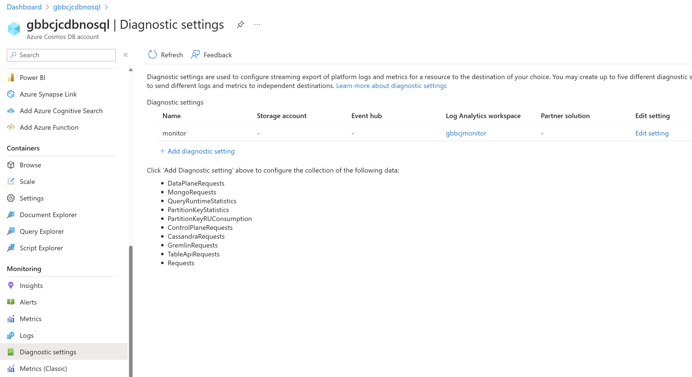
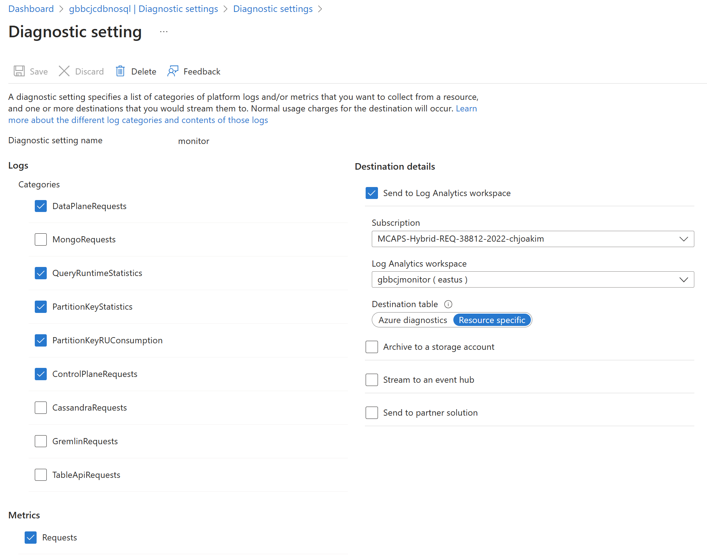
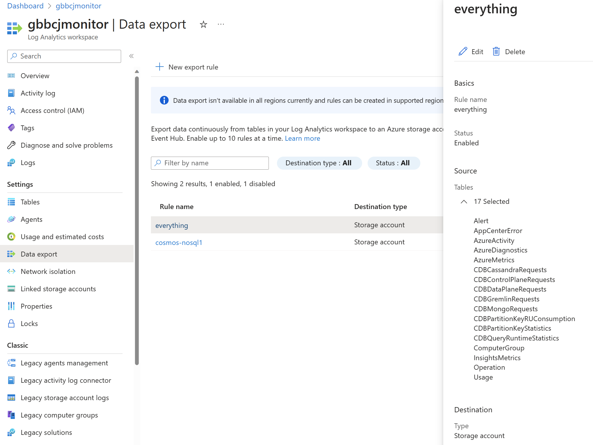
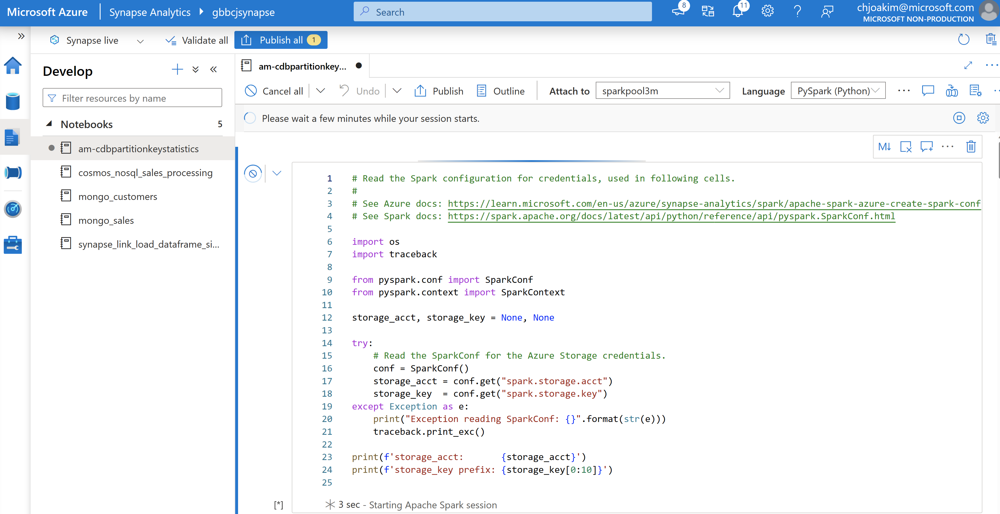

# Azure Cosmos DB : Partition Key Stats Aggregation in Synapse

**Chris Joakim, Microsoft, Cosmos DB Global Back Belt (GBB)**

This presentation: https://github.com/cjoakim/azure-cosmos-db-presentations/tree/main/partition_key_stats_logging

## The Cosmos DB Logging

Configure the Cosmos DB account to log to Azure Monitor.

    

---

    

---

## Azure Monitor - automated export to Azure Storage

Configure Azure Monitor to write to Azure Storage for long-term data retention.

    

---

## Azure Synapse - read and aggregate the blobs with Spark

- Read the many blobs exported from Azure Monitor, at 5-minute intervals
- Aggregate the data into a Spark DataFrame
- Write the DataFrame as CSV to another Azure Storage blob

    

img/spark-notebook-in-azure-synapse.png

[PySpark Notebook](am-cdbpartitionkeystatistics.ipynb)

---

## Next Steps - process the aggregated blob

These are just a few of many options:

- Import it into a relational database in Azure
  - Azure SQL
  - Azure Database for PostgreSQL
  - Azure Cosmos DB for PostgreSQL
- Process it with Spark
