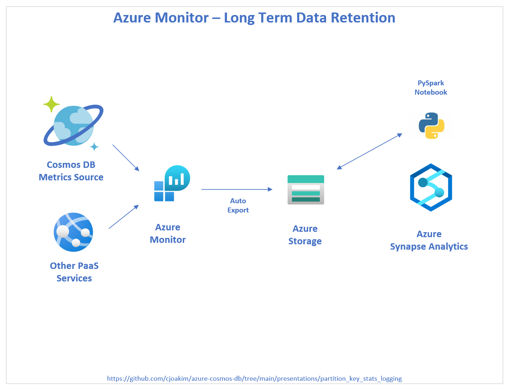
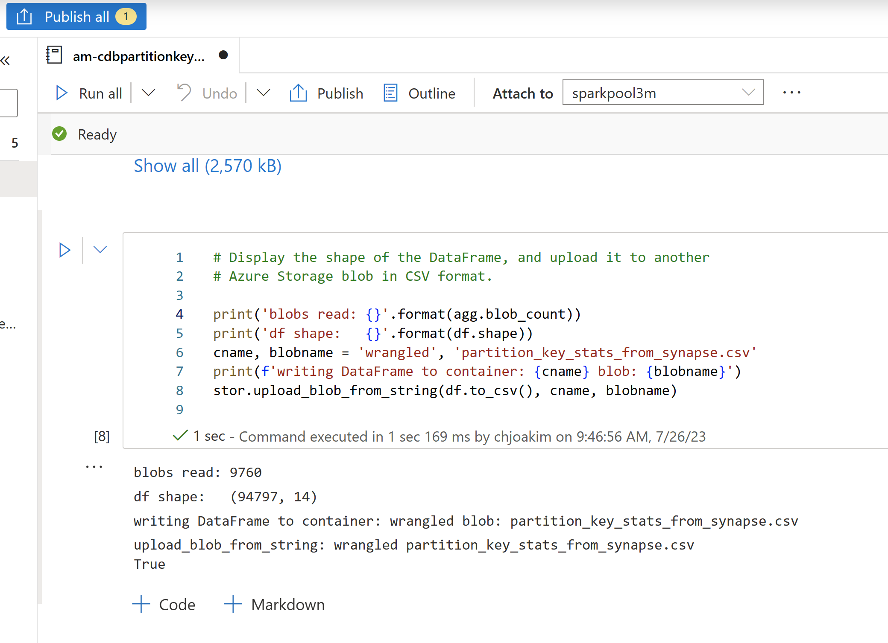

# Azure Cosmos DB : Partition Key Stats Aggregation in Synapse

**Chris Joakim, Microsoft, Cosmos DB Global Back Belt (GBB)**

This presentation: https://github.com/cjoakim/azure-cosmos-db/tree/main/presentations/partition_key_stats_logging

## Solution Architecture

Leverage PaaS services and cloud-native functionality.

    

---

## The Cosmos DB Logging

Configure the Cosmos DB account to log to Azure Monitor.

    

---

    

---

## Azure Monitor - automated export to Azure Storage

Configure Azure Monitor to write to Azure Storage for long-term data retention.

    

---

## Azure Synapse - read and aggregate the blobs with Spark

- Read the many blobs exported from Azure Monitor, at 5-minute intervals
- Aggregate the data into a Spark DataFrame
- Write the DataFrame as CSV to another Azure Storage blob

    

img/spark-notebook-in-azure-synapse.png

[PySpark Notebook](am-cdbpartitionkeystatistics.ipynb)

---

Output of the last cell in the Notebook.

    

---

## Next Steps - Process the Aggregated Blob

These are just a few of many options:

- Process it with Spark in Azure Synapse; see Links below

- Import it into a relational database in Azure:
  - [Azure SQL](https://azure.microsoft.com/en-us/products/azure-sql/database)
  - [Azure Database for PostgreSQL](https://azure.microsoft.com/en-us/products/postgresql)
  - [Azure Cosmos DB for PostgreSQL](https://learn.microsoft.com/en-us/azure/cosmos-db/postgresql/introduction)

- [Azure Machine Learning (AML)](https://azure.microsoft.com/en-us/products/machine-learning/)

- Consider a weekly or monthly rollup/aggregation process

---

## Links

- [Azure Synapse Analytics](https://azure.microsoft.com/en-us/products/synapse-analytics)
- [Spark Notebooks in Azure Synapse Analytics](https://learn.microsoft.com/en-us/azure/synapse-analytics/spark/apache-spark-development-using-notebooks)
- [Azure Storage Explorer Deskop tool](https://azure.microsoft.com/en-us/products/storage/storage-explorer)
- [Python Azure Storage SDK](https://learn.microsoft.com/en-us/python/api/overview/azure/storage?view=azure-python)
- [Pandas Python Library](https://pandas.pydata.org/)
- [Azure Cosmos DB](https://learn.microsoft.com/en-us/azure/cosmos-db/introduction)

