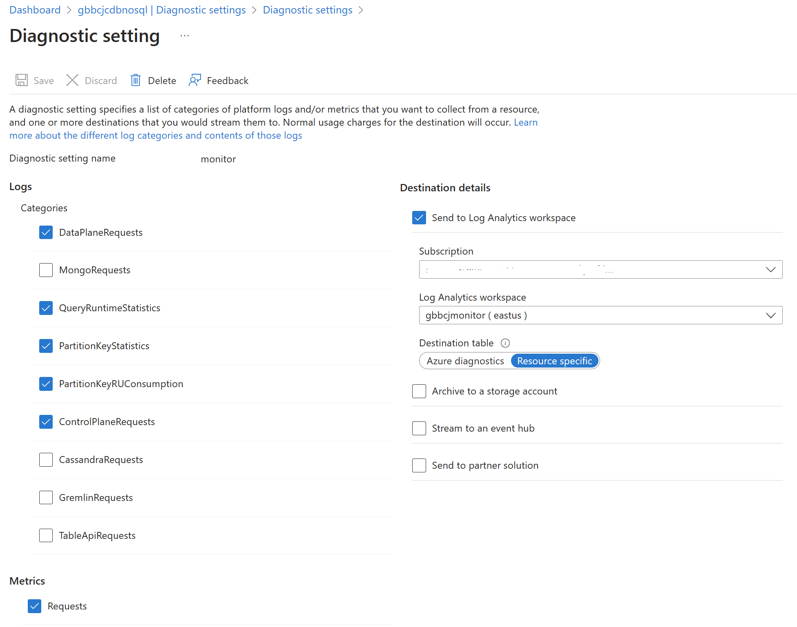

# Azure Cosmos DB : Partition Key Stats Aggregation in Synapse

**Chris Joakim, Microsoft, Cosmos DB Global Back Belt (GBB)**

This presentation: https://github.com/cjoakim/azure-cosmos-db-presentations/tree/main/partition_key_stats_logging

## The Cosmos DB Logging

Configure the Cosmos DB account to log to Azure Monitor.

    

    

## Azure Monitor - automated export to Azure Storage

Configure Azure Monitor to write to Azure Storage for long-term data retention.

    

